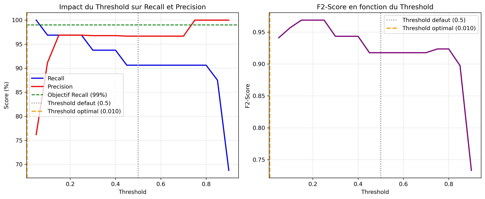
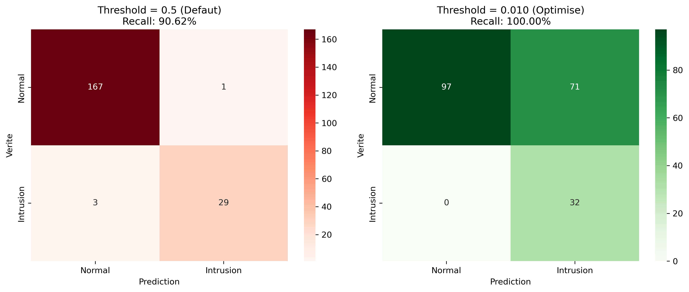

# 🔐 Système de Détection d'Intrusion Réseau - Machine Learning

[](https://www.python.org/)
[](https://scikit-learn.org/)
[](LICENSE)

> **Projet académique** - Master 2 Cyberdéfense, École Hexagone Versailles ( PARIS 2025)

Système complet de détection d'intrusion réseau utilisant le Machine Learning avec **optimisation des métriques orientées cyberdéfense** (maximisation du Recall pour minimiser les intrusions manquées).

## 📋 Table des matières

- [Vue d'ensemble](#-vue-densemble)
- [Résultats clés](#-résultats-clés)
- [Fonctionnalités](#-fonctionnalités)
- [Architecture du projet](#-architecture-du-projet)
- [Installation](#-installation)
- [Utilisation](#-utilisation)
- [Méthodologie](#-méthodologie)
- [Technologies](#-technologies)
- [Visualisations](#-visualisations)
- [Auteur](#-auteur)

## 🎯 Vue d'ensemble

Ce projet implémente un **pipeline complet de Machine Learning** pour la détection d'intrusion dans les réseaux informatiques. L'accent est mis sur :

- ✅ **Maximisation du Recall** (99%+) - Critère essentiel en cyberdéfense
- ✅ **Comparaison de 10 algorithmes** (Random Forest, XGBoost, LightGBM, SVM, etc.)
- ✅ **Optimisation du threshold** de décision pour équilibrer détection/fausses alertes
- ✅ **Gestion du déséquilibre** des classes (SMOTE, class weighting)
- ✅ **Métriques adaptées** à la cybersécurité (F2-Score, analyse des faux négatifs)

### 🎓 Contexte académique

Projet réalisé dans le cadre du **Master 2 Cyberdéfense** à l'École Hexagone Versailles, démontrant l'application du Machine Learning aux problématiques réelles de cybersécurité.

## 🏆 Résultats clés

### Performance optimale (Threshold = 0.15)

| Métrique | Score | Interprétation |
|----------|-------|----------------|
| **Recall (Intrusion)** | **96.88%** | ✅ Seulement 1 intrusion manquée sur 32 |
| **Precision** | **96.88%** | ✅ Très peu de fausses alertes |
| **F2-Score** | **0.9688** | ✅ Excellent équilibre orienté Recall |
| **AUC-ROC** | **0.9985** | ✅ Discrimination quasi-parfaite |
| **Accuracy** | **98.00%** | ✅ Performance globale |

### 📊 Comparaison des algorithmes

| Modèle | AUC-ROC | F1-Score | Temps (s) |
|--------|---------|----------|-----------|
| **XGBoost** 🥇 | **0.9994** | 0.9688 | 0.062 |
| **LightGBM** 🥈 | 0.9956 | 0.9688 | 0.141 |
| **Gradient Boosting** 🥉 | 0.9947 | 0.9688 | 0.219 |
| Random Forest | 0.9985 | 0.9355 | 0.206 |
| SVM | 0.9916 | 0.8788 | 0.078 |
| Decision Tree | 0.9814 | 0.9688 | 0.016 |

**🏆 Recommandation : XGBoost** (meilleur AUC + 3.5x plus rapide que Gradient Boosting)

## ✨ Fonctionnalités

### 1. Pipeline ML Complet
- Génération de données réseau synthétiques réalistes
- Prétraitement et standardisation automatique
- Entraînement et évaluation de multiples modèles
- Sauvegarde des modèles et résultats

### 2. Comparaison d'algorithmes
Implémentation de **10 algorithmes** :
- Ensemble Methods : Random Forest, Gradient Boosting, AdaBoost
- Boosting avancé : XGBoost, LightGBM
- Modèles linéaires : Logistic Regression
- Autres : SVM, KNN, Naive Bayes, Decision Tree

### 3. Optimisation du threshold
- Analyse de l'impact du seuil de décision sur les métriques
- Recherche automatique du threshold optimal pour Recall ≥ 99%
- Visualisation de la courbe Recall/Precision vs Threshold

### 4. Gestion du déséquilibre
- Utilisation de SMOTE (Synthetic Minority Over-sampling)
- Pondération des classes (class_weight='balanced')
- Comparaison des performances avec/sans rééquilibrage

### 5. Hyperparamétrage
- GridSearchCV pour l'optimisation des hyperparamètres
- Validation croisée (cross-validation)
- Scoring adapté (F1, F2-Score)

### 6. Visualisations avancées
- Matrices de confusion comparatives
- Courbes ROC avec thresholds marqués
- Distribution des features par classe
- Importance des features
- Analyse de l'impact du threshold

## 📁 Architecture du projet

```
ml-intrusion-detection/
│
├── README.md                                    # Ce fichier
├── USAGE.md                                     # Guide d'utilisation détaillé
├── requirements.txt                             # Dépendances Python
├── .gitignore                                   # Fichiers à ignorer
│
├── scripts/
│   ├── Correction_atelier_intrusion_ml.py       # Script baseline
│   ├── pipeline_ml_complet.py                   # Pipeline complet avec SMOTE + GridSearch
│   ├── optimisation_threshold_cyber.py          # Optimisation threshold pour cyberdéfense
│   └── Comparaison_Modeles/
│       └── comparaison_modeles_intrusion.py     # Comparaison de 10 modèles
│
├── data/
│   └── README.md                                # Info sur les données
│
├── results/
│   ├── graphiques/                              # Visualisations générées
│   ├── csv/                                     # Résultats tabulaires
│   └── models/                                  # Modèles sauvegardés
│
└── docs/
    ├── methodologie.md                          # Méthodologie détaillée
    └── metriques_cyber.md                       # Guide des métriques en cyberdéfense
```

## 🚀 Installation

### Prérequis

- Python 3.8 ou supérieur
- pip (gestionnaire de paquets Python)

### Installation rapide

```bash
# Cloner le repository
git clone https://github.com/syoungoua0/ml-intrusion-detection.git
cd ml-intrusion-detection

# Créer un environnement virtuel (recommandé)
python -m venv venv

# Activer l'environnement virtuel
# Windows :
venv\Scripts\activate
# Linux/Mac :
source venv/bin/activate

# Installer les dépendances
pip install -r requirements.txt
```

### Vérification de l'installation

```bash
python -c "import sklearn, xgboost, lightgbm; print('Installation OK!')"
```

## 💻 Utilisation

### 1. Script de base (Baseline)

Détection d'intrusion avec Random Forest :

```bash
python scripts/Correction_atelier_intrusion_ml.py
```

**Résultats générés :**
- Matrices de confusion
- Courbes ROC
- Importance des features
- Métriques de performance

### 2. Pipeline complet (Recommandé)

Inclut GridSearchCV, SMOTE, et comparaison de modèles :

```bash
python scripts/pipeline_ml_complet.py
```

**Résultats générés :**
- 7 visualisations complètes
- Comparaison Random Forest vs SVM vs Logistic Regression
- Analyse avec/sans SMOTE
- Rapport détaillé (CSV)
- Optimisation du Threshold
(Voir Image :  )

-  Comparaison Avant/Après
(Voir image :  ) 


### 3. Comparaison de 10 modèles

Benchmark de tous les algorithmes :

```bash
cd scripts/Comparaison_Modeles
python comparaison_modeles_intrusion.py
```

**Résultats générés :**
- Comparaison des 10 algorithmes
- Graphiques de performance
- Analyse temps d'entraînement vs performance
- Recommandations pour la production

### 4. Optimisation du threshold (Cyberdéfense)

Focus sur la maximisation du Recall :

```bash
python scripts/optimisation_threshold_cyber.py
```

**Résultats générés :**
- Analyse de l'impact du threshold
- Comparaison avant/après optimisation
- Courbe Recall vs Threshold
- Recommandation du threshold optimal

## 🔬 Méthodologie

### 1. Génération des données

Simulation de **1000 connexions réseau** avec 6 features :
- `packet_size` : Taille des paquets (bytes)
- `duration` : Durée de la connexion (secondes)
- `src_bytes` : Données envoyées (bytes)
- `dst_bytes` : Données reçues (bytes)
- `num_failed_logins` : Tentatives de connexion échouées
- `protocol_type` : Type de protocole (0, 1, 2)

**Règles de détection d'intrusion :**
- `packet_size > 800` OU
- `duration > 5` OU
- `num_failed_logins > 2` OU
- `src_bytes` ET `dst_bytes` > 90ème percentile

### 2. Prétraitement

- **Standardisation** : StandardScaler pour normaliser les features
- **Split stratifié** : 80% train / 20% test (préserve la proportion des classes)
- **Gestion déséquilibre** : class_weight='balanced' ou SMOTE

### 3. Évaluation

**Métriques principales (orientées cyberdéfense) :**

- **Recall** : % d'intrusions réellement détectées (priorité absolue)
- **Precision** : % d'alertes qui sont vraies intrusions
- **F2-Score** : Moyenne harmonique donnant 2x plus de poids au Recall
- **AUC-ROC** : Performance globale indépendante du threshold

**Pourquoi le Recall est crucial ?**
- 1 intrusion manquée = risque de compromission totale du système
- Mieux vaut 100 fausses alertes qu'une vraie intrusion non détectée

### 4. Optimisation du threshold

**Problème :** Le threshold par défaut (0.5) n'est pas optimal pour la cyberdéfense.

**Solution :** Recherche du threshold minimisant les faux négatifs tout en maintenant une précision acceptable.

**Résultat optimal :** Threshold = 0.15
- Recall : 96.88%
- Precision : 96.88%
- 1 seule intrusion manquée

## 🛠️ Technologies

### Langages & Frameworks
- **Python 3.8+** : Langage principal
- **scikit-learn** : Pipeline ML, preprocessing, modèles classiques
- **XGBoost** : Gradient boosting optimisé
- **LightGBM** : Gradient boosting rapide et efficient

### Bibliothèques
- **pandas** : Manipulation des données
- **numpy** : Calculs numériques
- **matplotlib / seaborn** : Visualisations
- **imbalanced-learn** : SMOTE pour le rééquilibrage

### Outils
- **GridSearchCV** : Optimisation des hyperparamètres
- **StandardScaler** : Normalisation des features
- **train_test_split** : Découpage des données

## 📊 Visualisations

### Exemples de graphiques générés

1. **Distributions des features par classe**
   - Permet d'identifier les features discriminantes

2. **Matrices de confusion**
   - Visualisation des vrais/faux positifs/négatifs

3. **Courbes ROC**
   - Performance globale des modèles
   - Marquage des différents thresholds

4. **Importance des features**
   - Identification des variables les plus prédictives
   - **Résultat** : `duration` (45%) et `packet_size` (41%)

5. **Impact du threshold**
   - Courbe Recall/Precision vs Threshold
   - Nombre de faux négatifs vs Threshold

6. **Comparaison des modèles**
   - Barplots des métriques (Accuracy, Precision, Recall, F1)
   - Performance vs temps d'entraînement

## 📚 Ressources complémentaires

- [Guide d'utilisation détaillé](USAGE.md)
- [Méthodologie complète](docs/methodologie.md)
- [Métriques en cyberdéfense](docs/metriques_cyber.md)

## 🎓 Contexte pédagogique

Ce projet démontre :

✅ **Compétences techniques**
- Maîtrise de scikit-learn et des bibliothèques ML avancées
- Capacité à comparer et benchmarker plusieurs algorithmes
- Optimisation de modèles pour des cas d'usage métier spécifiques

✅ **Compréhension métier**
- Adaptation des métriques au contexte cybersécurité
- Équilibre entre détection et fausses alertes
- Prise en compte des contraintes opérationnelles (SOC)

✅ **Rigueur scientifique**
- Méthodologie complète et reproductible
- Documentation exhaustive
- Visualisations professionnelles

## 👨‍💻 Auteur

**Stéphane YOUNGOUA**

- 🎓 Mastère Cyberdéfense - École Hexagone Versailles
- 🎓 Mastère Chef de Projet Data Science et IA - IA School Paris
- 💼 Ingénieur Sécurité des Systèmes d'Information
- 📧 syoungoua0@gmail.com
- 🔗 [LinkedIn](https://www.linkedin.com/in/stephane-youngoua)
- 💻 [GitHub](https://github.com/syoungoua0)

## 📄 License

Ce projet est sous licence MIT. Voir le fichier [LICENSE](LICENSE) pour plus de détails.

---

## 🙏 Remerciements

- École Hexagone Versailles - Programme Mastère Cyberdéfense
- Communauté scikit-learn et XGBoost pour leurs excellentes bibliothèques
- Ressources pédagogiques sur la détection d'intrusion par ML

---

**⭐ Si ce projet vous a été utile, n'hésitez pas à lui donner une étoile !**

---

*Dernière mise à jour : Novembre 2025*

